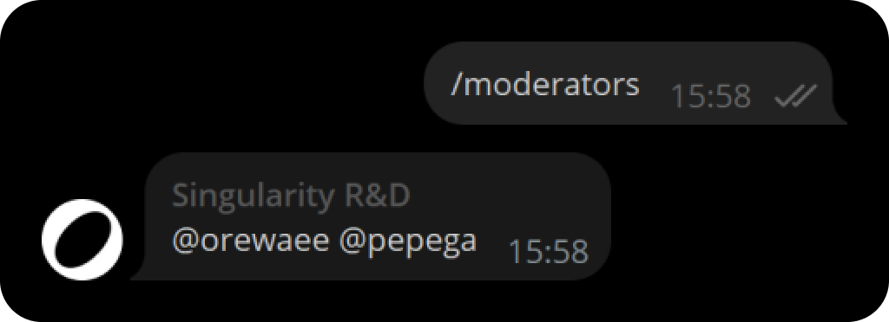

# MentionsBot

A small Telegram bot that adds @all to groups

### Launch
To launch the bot, there are two options. The first is through Docker, the second is through fat Jar.

#### Docker
The first step is to collect an image of the project. To do this use the command:

```shell
docker build -t mentions-bot .
```

Next, launch the container based on the image you just created:

```shell
docker run --name mentions-bot -d -e BOT_TOKEN='' mentions-bot
```

#### Fat Jar
To do this, download the jar file from the latest release or build it yourself:

```shell
.\gradlew shadowJar
```

After that, run the `jar` file, having first created the `BOT_TOKEN` environment variable:
```shell
java -jar MentionsBot-1.1.0.jar
```

#### TODO
- [x] Make different name sources for different groups
- [x] Add the ability to manage names through commands
